# Claims-AI MVP: AI-Powered Insurance Claim Analysis

**Tired of spending hours manually sifting through dense claim documents?** Claims-AI is an open-source prototype designed to revolutionize how legal and insurance professionals analyze complex claims. By intelligently combining document ingestion, Optical Character Recognition (OCR), Retrieval-Augmented Generation (RAG) with local Large Language Models (LLMs), and innovative analysis tools, Claims-AI drastically cuts down review time and surfaces critical insights faster than ever.

This MVP demonstrates a powerful, privacy-focused approach using entirely open-source components and a locally hosted LLM (like Phi-4 via LM Studio), putting advanced AI capabilities directly in your hands.

---

## 1. Why Claims-AI?

The traditional claims process is often slow, laborious, and prone to inconsistencies. Analysts face mountains of documents in various formats (PDFs, TIFFs, DOCX), spending valuable time on manual review instead of strategic analysis. Claims-AI tackles this head-on with the following objectives:

- **⏱️ Slash Manual Review Time:** Reduce the time spent reading documents by over 60% (O-1).
- **🎯 Boost Answer Accuracy:** Achieve ≥90% accuracy for questions, with answers grounded in specific document citations (O-2).
- **📝 Generate Quality Drafts:** Produce high-quality initial strategy notes, rated ≥4/5 by handlers (O-3).
- **💡 Surface Relevant Insights:** Automatically find similar past precedents and self-assess answer confidence (O-4).
- **⚡ Maintain Performance:** Keep chat responses under 5 seconds and draft note generation under 20 seconds (O-5).
- **✅ Ensure Reliability:** Maintain automated test coverage ≥85%, supported by CI/CD and clear documentation (O-6).

---

## 2. Core Capabilities

Claims-AI integrates several powerful features into a seamless workflow:

### 2.1 Smart Document Ingestion & OCR

- **Effortless Upload:** Drag-and-drop PDFs, TIFFs, and DOCX files directly into the web UI or use the API.
- **Automated Text Extraction:** Leverages Tesseract OCR, PDFMiner, and `python-docx` to accurately extract text content, even from scanned documents.
- **Organized Storage:** Stores extracted text in structured JSON files (`data/processed_text/`) and logs processing metadata in a PostgreSQL database.

### 2.2 AI-Powered Q&A with Source Citations (`/api/v1/ask`)

- **Understand Your Question:** Converts natural language questions into vector embeddings.
- **Find Relevant Evidence:** Performs efficient hybrid search (semantic + keyword) across all ingested documents using ChromaDB.
- **Generate Grounded Answers:** Uses a local LLM (Phi-4) to generate answers based *only* on the retrieved document excerpts, providing citations back to the source.

### 2.3 On-Demand Summarization (`/api/v1/summarise`)

- **Flexible Input:** Request a summary by providing either a specific document ID (from ingested files) or pasting raw text directly.
- **Concise Overviews:** Generates factual, concise summaries using the Phi-4 model.

### 2.4 Automated Strategy Note Drafting (`/api/v1/draft`)

- **Context-Aware Generation:** Takes claim summaries, relevant document IDs, Q&A history, and specific criteria as input.
- **Structured Output:** Compiles context, prompts Phi-4 to generate a comprehensive strategy note (covering findings, risks, recommendations), and exports it directly as a `.docx` file.

---

## 3. Innovative Features

Beyond the core workflow, Claims-AI includes unique features to enhance analysis and trust:

- **🔎 Proactive Precedent Discovery (`/api/v1/precedents`):** Submit a new claim's summary and instantly retrieve the top-k most similar historical claims from the precedent database.
- **📊 Automated Answer Quality Assurance (Confidence Score & Self-Healing):** The Q&A system scores the LLM's confidence in its own answers (1-5). If below a threshold, it automatically attempts to re-evaluate the context and generate a better, more confident response.
- **🔊 Accessible Insights via Voice (`/api/v1/speech`):** Generate text-to-speech audio (MP3) for any text, including AI answers, using Coqui TTS. Audio is stored in Minio and playable directly in the UI.
- **🛡️ Built-in Robustness Testing (`/api/v1/redteam/run`):** Execute a suite of adversarial prompts against the RAG system directly via the API or UI to evaluate its safety and reliability.

---

## 4. Architecture



*You can regenerate this diagram using `make arch-diagram` which converts `docs/architecture.md` (Mermaid source) to SVG.*

**Core Components:**

1. **Frontend**: User-facing web application built with React, Vite, and Chakra UI. (Runs on host port 5173 by default).
2. **Backend**: Central API gateway built with FastAPI (Python). Handles requests, orchestrates services, and interacts with the LLM. (Runs on host port 8000 by default).
3. **PostgreSQL**: Relational database storing document metadata, processing status, and potentially other structured data.
4. **ChromaDB**: Open-source vector database used for efficient similarity search on document chunks (for RAG) and precedents.
5. **Minio**: S3-compatible object storage for raw documents, processed text, generated audio files, and potentially other artifacts.
6. **LM Studio (User-Managed)**: Desktop application run *locally* by the user to host and serve the LLM (e.g., `phi-4-reasoning-plus`) via an OpenAI-compatible API (typically on `http://localhost:1234`). Claims-AI interacts with this local API.
7. **Coqui TTS (Optional Service)**: Dockerized text-to-speech service used for the voice-over feature. (Runs on host port 5002 by default if using `docker-compose.dev.yml` or included in the main compose file).

All backend services (except the user-managed LM Studio) are containerized using Docker Compose for easy setup and consistent environments.

---

## 5. Getting Started

Follow these steps to set up and run Claims-AI on your local machine (macOS/Linux).

### 5.1 Prerequisites

Ensure you have the following installed:

- **Git:** For cloning the repository. (`git --version`)
- **Docker & Docker Compose:** For running containerized services. Docker Desktop is recommended for macOS. (`docker --version`, `docker-compose --version`)
    - **Important:** Start Docker Desktop and allocate at least 8GB RAM and 4 CPUs to it in Docker Desktop settings.
- **Python:** Version 3.11 recommended. (`python --version` or `python3 --version`).
- **Node.js:** Version 20 recommended. (`node --version`).
- **pnpm:** Performant Node.js package manager. (`pnpm --version`). Install via `npm install -g pnpm` if needed.
- **(Optional but Recommended) OCR Engine:** Tesseract for document text extraction. (`tesseract --version`).
- **(Optional) Multimedia Framework:** FFmpeg, potentially used by TTS. (`ffmpeg --version`).

*Tip: On macOS, you can install most of these using Homebrew: `brew install git docker docker-compose node@20 pnpm python@3.11 tesseract ffmpeg`*

- **LM Studio:**
    1. Download and install LM Studio from [lmstudio.ai](https://lmstudio.ai/).
    2. Launch LM Studio.
    3. Search for and download the `microsoft/phi-4-reasoning-plus-GGUF` model (or another compatible model).
    4. Go to the \"Local Server\" tab (<\--> icon).
    5. Select the downloaded model.
    6. **Important:** Start the server. Ensure it's running on the default port `1234`.

### 5.2 Setup

1. **Clone the Repository:**
    ```bash
    git clone git@github.com:jlov7/Claims-AI.git # Replace with your repo URL if different
    cd Claims-AI
    ```

2. **Configure Environment:**
    - Copy the sample environment file:
      ```bash
      cp .env.sample .env
      ```
    - **Crucial:** Open the `.env` file and review the settings. While defaults often work for local setup (especially `run-docker` mode), you might need to adjust ports or API keys if your setup differs. **Do not commit your `.env` file.**

3. **Install Dependencies & Hooks (using Makefile):**
    - This single command sets up the Python virtual environment, installs all backend and frontend dependencies, and installs pre-commit hooks.
      ```bash
      make setup
      ```
    - *After setup, activate the Python virtual environment for subsequent `make` commands or direct script execution:* `source .venv/bin/activate`

### 5.3 Running the Application

You have two main options for running the application:

**Option 1: Full Docker Mode (Recommended)**

This runs the entire backend stack (API, database, vector store, object storage, TTS) in Docker containers. Only the frontend runs locally.

1. **Start Services:**
    ```bash
    make run-docker
    ```
    *(This runs `docker-compose up --build -d` and checks service health.)*

2. **Load & Process Demo Data (First time or with new data):**
    ```bash
    make load-demo  # Copies sample PDFs to data/raw/demo/
    make process-demo # Runs OCR and embedding scripts inside Docker
    ```
    *Note: `make process-demo` runs the extraction and embedding steps sequentially.* 

3. **(Optional) Embed Precedents:**
    ```bash
    make embed-precedents # Embeds data from data/precedents/precedents.csv
    ```

4. **Start Frontend:**
    ```bash
    make run-dev-frontend
    ```
    *(This runs `cd frontend && pnpm dev`)*

5. **Access:**
    - **Web UI:** Open your browser to `http://localhost:5173/claims-ai/` (or as indicated by Vite).
    - **Backend API Docs:** `http://localhost:8000/docs`
    - **Minio Console:** `http://localhost:9001` (Use keys from `.env`)

**Option 2: Local Development Mode**

This is useful if you are actively developing the *backend* Python code. You run the FastAPI backend directly on your host machine, while other services (Postgres, Minio, ChromaDB, TTS) still run in Docker.

1. **Start Required Docker Services:**
    ```bash
    docker-compose up -d postgres minio chromadb # Add 'tts' if needed for voice features
    ```
    *Wait for these to be healthy (`make check-services` can help verify, though it checks all services).* 

2. **Configure `.env` for Local Backend:**
    - **Important:** Ensure `POSTGRES_HOST`, `MINIO_URL`, `CHROMA_HOST`, `COQUI_TTS_URL` in your `.env` file point to `localhost` (or the correct host-mapped ports), **not** the Docker service names.

3. **Load & Process Data (using local Python environment):**
    *(Ensure venv is active: `source .venv/bin/activate`)*
    ```bash
    make load-demo
    python scripts/extract_text.py --src data/raw/demo --out data/processed_text
    python scripts/chunk_embed.py --in data/processed_text
    # python scripts/embed_precedents.py # Optional
    ```

4. **Start Backend Locally:**
    *(Ensure venv is active)*
    ```bash
    make run-dev-backend
    ```

5. **Start Frontend (in a separate terminal):**
    ```bash
    make run-dev-frontend
    ```

6. **Access:** URLs are the same as in Docker mode.

### 5.4 Stopping the Application

- **Stop all Docker services:**
  ```bash
  make stop
  ```
- **Clean up (Removes Docker volumes - ALL DATA WILL BE LOST):**
  ```bash
  make clean
  ```

---

## 6. Usage Examples

### Ask a Question
```bash
curl -X POST http://localhost:8000/api/v1/ask \
  -H 'Content-Type: application/json' \
  -d '{"query":"What is the claimant asking for?"}'
```

### Summarise a Document
```bash
curl -X POST http://localhost:8000/api/v1/summarise \
  -H 'Content-Type: application/json' \
  -d '{"document_id":"demo_claim_01.pdf.json"}'
```

### Generate Strategy Note
```bash
curl -X POST http://localhost:8000/api/v1/draft \
  -H 'Content-Type: application/json' \
  -d '{"claim_summary":"Auto accident summary...","output_filename":"MyClaimNote.docx"}' --output MyClaimNote.docx
```

### Find Precedents
```bash
curl -X POST http://localhost:8000/api/v1/precedents \
  -H 'Content-Type: application/json' \
  -d '{"claim_summary":"water damage claim"}'
```

### Text-to-Speech
```bash
curl -X POST http://localhost:8000/api/v1/speech \
  -H 'Content-Type: application/json' \
  -d '{"text":"Hello, Claims-AI user!"}'
```

### Run Red-Team Evaluation
```bash
curl http://localhost:8000/api/v1/redteam/run | jq .
```

### 6.3 Upload Documents

Replace `sample.pdf` with your file path.

```bash
curl -X POST -F "files=@sample.pdf" http://localhost:8000/api/v1/documents/upload | jq .
```

### 6.4 Generate Voice

```bash
curl -X POST -H "Content-Type: application/json" -d '{"text": "Hello world from Claims AI!"}' http://localhost:8000/api/v1/speech | jq .
```

### 6.5 Run Red Team

```bash
curl http://localhost:8000/api/v1/redteam/run | jq .
```

---

## 7. Testing & Quality

Comprehensive tests ensure reliability:

- **Backend Unit & Integration Tests:**
  ```bash
  make test-backend
  ```
  *This runs `pytest` with coverage tracking. The HTML report is available in `htmlcov/index.html`. Aim for ≥85% coverage.*

- **Frontend Unit Tests:**
  ```bash
  make test-frontend
  ```
  *This runs Vitest tests located in `frontend/src/__tests__/`.*

- **End-to-End Tests:**
  ```bash
  make test-e2e
  ```
  *This runs Playwright tests located in `tests/e2e/`. Requires the full application stack to be running.*

- **Linting & Formatting:**
  ```bash
  make lint    # Check backend (Ruff) and frontend (ESLint) code style
  make format  # Apply backend (Black, Ruff fix) and frontend (Prettier) formatting
  ```

- **Pre-commit Hooks:** Configured in `.pre-commit-config.yaml` to automatically run formatters/linters before each commit (install via `make setup` or `pre-commit install`).

---

## 8. Continuous Integration

GitHub Actions pipeline (`.github/workflows/ci.yml`) runs on every push/PR:

1.  **Linting:** Runs Ruff (backend) and ESLint (frontend).
2.  **Backend Tests:** Executes `pytest` with coverage checks.
3.  **Frontend Tests:** Executes `pnpm test` (`vitest`).
4.  **Frontend Build:** Executes `pnpm build`.

The workflow ensures code quality and functionality before merging changes.

---

## 9. Future Roadmap & Enterprise Migration

This MVP provides a strong foundation. Future enhancements and enterprise migration paths could include mapping the POC components to robust, scalable cloud services (Azure, AWS, GCP):

1.  **Production Infrastructure & Orchestration:**
    *   **POC:** Docker Compose
    *   **Enterprise:** Kubernetes (Azure AKS, AWS EKS, GCP GKE) with Helm/Terraform for deployment; managed container registries (ACR, ECR, Artifact Registry).
2.  **Secrets & Configuration:**
    *   **POC:** `.env` file
    *   **Enterprise:** Cloud-native secret management (Azure Key Vault, AWS Secrets Manager, GCP Secret Manager).
3.  **Observability:**
    *   **POC:** Basic logging to console/Docker logs.
    *   **Enterprise:** Comprehensive monitoring (Prometheus/Grafana on K8s or Azure Monitor, AWS CloudWatch, Google Cloud Monitoring) and centralized logging (ELK stack, Azure Log Analytics, CloudWatch Logs, Cloud Logging).
4.  **CI/CD Pipelines:**
    *   **POC:** GitHub Actions (lint, test, build).
    *   **Enterprise:** Integrate GitHub Actions with cloud deployment tools (Azure DevOps Pipelines, AWS CodePipeline/CodeBuild, Google Cloud Build/Deploy) for automated infrastructure provisioning and application deployment.
5.  **Data Storage & Vector Search:**
    *   **RDBMS (Metadata):** PostgreSQL (Docker) -> Managed PostgreSQL (Azure Database for PostgreSQL, AWS RDS, Google Cloud SQL).
    *   **Object Storage (Files, Audio):** Minio (Docker) -> Cloud Object Storage (Azure Blob Storage, AWS S3, Google Cloud Storage).
    *   **Vector Database:** ChromaDB (Docker) -> Managed Vector Stores (Azure AI Search vector store, AWS OpenSearch Serverless with vector plugin, GCP Vertex AI Matching Engine).
6.  **LLMs & Embeddings:**
    *   **LLM:** LM Studio (Local Phi-4) -> Managed LLMs (Azure OpenAI GPT-4, AWS Bedrock Claude/Titan, GCP Vertex AI Gemini). Consider fine-tuning for specific domains.
    *   **Embeddings:** LM Studio (Local Nomic) -> Cloud Embedding APIs (Azure OpenAI Embeddings, AWS Bedrock Embeddings, Vertex AI Embeddings) or self-hosted embedding services.
7.  **Text-to-Speech:**
    *   **TTS:** Coqui TTS (Docker) -> Cloud TTS Services (Azure Speech Service, AWS Polly, Google Cloud Text-to-Speech) integrated via serverless functions or microservices for scalability.
8.  **API Gateway & Security:**
    *   **Gateway:** FastAPI (Direct) -> Cloud API Gateways (Azure API Management, AWS API Gateway, GCP API Gateway) for traffic management, rate limiting, security.
    *   **Auth:** None -> Robust Authentication/Authorization (OAuth2/OIDC via Azure AD, AWS Cognito, Google Identity Platform), Role-Based Access Control (RBAC).
9.  **Scalability & Resilience:**
    *   **Compute:** Docker containers -> Horizontal autoscaling (Kubernetes HPA, Azure Container Apps, AWS Fargate, GCP Cloud Run).
    *   **Ingestion:** Script-based -> Asynchronous batch ingestion pipelines (Azure Functions, AWS Lambda, Cloud Functions) triggered by storage events, using message queues (Azure Service Bus, AWS SQS, GCP Pub/Sub) for decoupling.
10. **Advanced Features & Governance:**
    *   **LLM Evaluation:** Ad-hoc -> Rigorous frameworks (RAGAs, DeepEval), MLOps integration.
    *   **Explainability:** Limited -> SHAP, LIME integration.
    *   **BI/Reporting:** None -> Power BI, QuickSight, Looker dashboards.
    *   **Compliance:** Basic -> Audit trails, GDPR/CCPA features, fine-grained access control.

By systematically mapping each POC component to its enterprise-grade cloud equivalent, Claims-AI can transition from a local prototype into a scalable, secure, and compliant application ready for client deployment.

**Enterprise Migration Mapping Summary:**

| Category             | POC Component           | Enterprise Azure                     | Enterprise AWS                          | Enterprise GCP                          |
| :------------------- | :---------------------- | :----------------------------------- | :-------------------------------------- | :-------------------------------------- |
| Orchestration        | Docker Compose          | Azure Kubernetes Service (AKS)       | Elastic Kubernetes Service (EKS)        | Google Kubernetes Engine (GKE)          |
| Container Registry   | Docker Hub (Implicit)   | Azure Container Registry (ACR)     | Elastic Container Registry (ECR)        | Google Artifact Registry              |
| Secrets & Config     | `.env` File             | Azure Key Vault                      | AWS Secrets Manager                     | GCP Secret Manager                      |
| Observability        | Console/Docker Logs     | Azure Monitor / Log Analytics        | AWS CloudWatch                          | Google Cloud Monitoring/Logging         |
| CI/CD                | GitHub Actions          | GitHub Actions + Azure DevOps        | GitHub Actions + AWS CodePipeline       | GitHub Actions + Google Cloud Build     |
| RDBMS (Metadata)     | PostgreSQL (Docker)     | Azure Database for PostgreSQL        | AWS RDS (PostgreSQL)                    | Google Cloud SQL (PostgreSQL)           |
| Object Storage       | Minio (Docker)          | Azure Blob Storage                   | AWS S3                                  | Google Cloud Storage                  |
| Vector Database      | ChromaDB (Docker)       | Azure AI Search (Vector Store)       | AWS OpenSearch Serverless (Vector)      | GCP Vertex AI Matching Engine         |
| LLM                  | LM Studio (Local Phi-4) | Azure OpenAI (GPT-4)                 | AWS Bedrock (Claude/Titan)              | GCP Vertex AI (Gemini)                  |
| Embeddings           | LM Studio (Local Nomic) | Azure OpenAI Embeddings              | AWS Bedrock Embeddings                  | GCP Vertex AI Embeddings              |
| Text-to-Speech       | Coqui TTS (Docker)      | Azure Speech Service                 | AWS Polly                               | Google Cloud Text-to-Speech           |
| API Gateway          | FastAPI (Direct)        | Azure API Management                 | AWS API Gateway                         | GCP API Gateway                       |
| Authentication       | None                    | Azure AD (Entra ID)                  | AWS Cognito                             | Google Identity Platform              |
| Scalable Compute     | Docker Containers       | AKS Nodes / Azure Container Apps     | AWS Fargate / EKS Nodes                 | GKE Nodes / Google Cloud Run          |
| Batch Ingestion      | Python Scripts (Sync)   | Azure Functions / Logic Apps         | AWS Lambda / Step Functions             | Google Cloud Functions / Workflows    |
| Message Queue        | None                    | Azure Service Bus                    | AWS SQS                                 | GCP Pub/Sub                           |
| BI/Reporting         | None                    | Power BI                             | AWS QuickSight                          | Google Looker Studio                  |

---

For deeper background and intermediate steps, see [project.md](project.md), [tasks.md](tasks.md), and `explanations.txt` for per-phase narratives. 