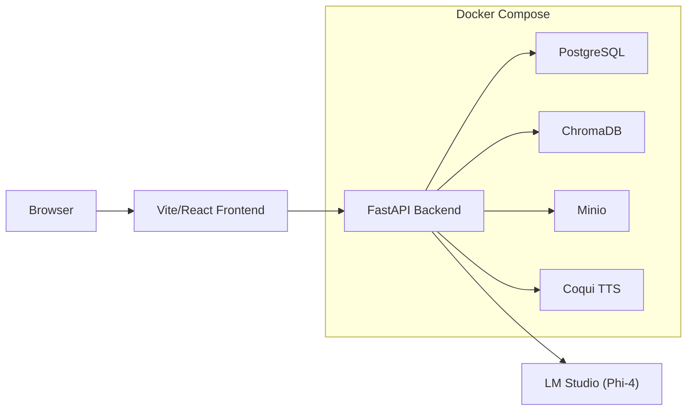

# Architecture Diagram

This diagram shows how the Claims-AI system components interact.

```mermaid
graph LR
    Browser["Browser"]
    Frontend["Vite/React Frontend"]
    Backend["FastAPI Backend"]
    Postgres["PostgreSQL"]
    Chroma["ChromaDB"]
    Minio["Minio"]
    LMStudio["LM Studio (Phi-4)"]
    TTS["Coqui TTS"]

    Browser --> Frontend
    Frontend --> Backend
    Backend --> Postgres
    Backend --> Chroma
    Backend --> Minio
    Backend --> LMStudio
    Backend --> TTS

    subgraph "Docker Compose"
      Backend
      Postgres
      Chroma
      Minio
      TTS
    end
``` 