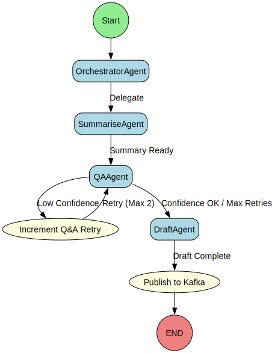

# How Claims-AI Agentic Demo Works

This document explains the workflow of the Claims-AI agentic demo, from receiving a user request to generating a strategy note and publishing key facts.

## Agentic Workflow Diagram

The following diagram illustrates the sequence of agents and key decision points in the process:

*Diagram generated from the LangGraph definition.*

## Step-by-Step Flow

The process generally follows these steps:

1.  **Start & Orchestration**: The process begins when a user request is received. The OrchestratorAgent takes charge.
    <ul>
    
        <li>Receives initial user request, document ID, and any other parameters.</li>
    
        <li>Sets up the initial state for the agentic workflow.</li>
    
        <li>Determines the overall goal and sequence of agent execution (e.g., Summarise -> QA -> Draft).</li>
    
    </ul>

1.  **Summarisation (SummariseAgent)**: The SummariseAgent processes the input document(s) to create a concise summary.
    <ul>
    
        <li>Utilizes RAG pipeline or direct text content.</li>
    
        <li>Generates a summary of the key information from the claim documents.</li>
    
        <li>May use tools like Smart-Skim (conceptually) to identify important sections.</li>
    
    </ul>

1.  **Question & Answering (QAAgent)**: The QAAgent answers specific questions based on the document content and summary, providing cited sources.
    <ul>
    
        <li>Takes user queries (can be pre-defined or ad-hoc).</li>
    
        <li>Uses the RAG pipeline to find relevant context in documents.</li>
    
        <li>Generates answers and provides source information (e.g., page numbers, document snippets).</li>
    
        <li>Includes a self-correction/retry loop: if confidence in an answer is low (and retries < max), it attempts to refine the answer (via IncrementRetry node).</li>
    
    </ul>

1.  **Drafting (DraftAgent)**: The DraftAgent creates a comprehensive strategy note using the accumulated information.
    <ul>
    
        <li>Gathers context from the summary and Q&A history.</li>
    
        <li>Can utilize tools to enrich the draft:</li>
    
        <li>  - `get_reserve_prediction`: Calls the Reserve Predictor microservice.</li>
    
        <li>  - `get_negotiation_tip`: Calls the Negotiation Coach tool for tactical advice.</li>
    
        <li>The LLM integrates tool outputs and other context into a coherent strategy note (DOCX format).</li>
    
    </ul>

1.  **Publish to Kafka (PublishToKafka Node)**: Key facts and outcomes from the completed workflow are published to a Kafka topic.
    <ul>
    
        <li>Serializes relevant data from the agent state (e.g., session ID, document ID, summary, final answer, draft file path, negotiation tip).</li>
    
        <li>Sends this data as a JSON payload to the `claim-facts` Kafka topic.</li>
    
        <li>This allows other systems or UI components (like the Kafka Inspector) to consume these results.</li>
    
    </ul>

1.  **End**: The workflow concludes after publishing to Kafka.

## Key Technologies Involved

- **Orchestration**: LangGraph
- **Language Model (Local)**: Mistral-7B-Instruct (via Ollama)
- **Core Agents**:
    - OrchestratorAgent: Manages the overall flow and delegates tasks.
    - SummariseAgent: Generates summaries of claim documents.
    - QAAgent: Answers questions based on document content, with citations.
    - DraftAgent: Produces a strategy note, utilizing tools like the Reserve Predictor and Negotiation Coach.
- **Tools**:
    - Smart-Skim (Heatmap): Identifies relevant pages in large documents.
    - Reserve Predictor: Estimates potential claim reserve values.
    - Negotiation Coach: Provides tips based on solicitor and injury type.
- **Event Bus**: Redpanda (Kafka-compatible) for publishing `claim-facts`.
- **API Layer**: LangServe, integrated with FastAPI.

---
*This document is auto-generated. Do not edit directly.* 